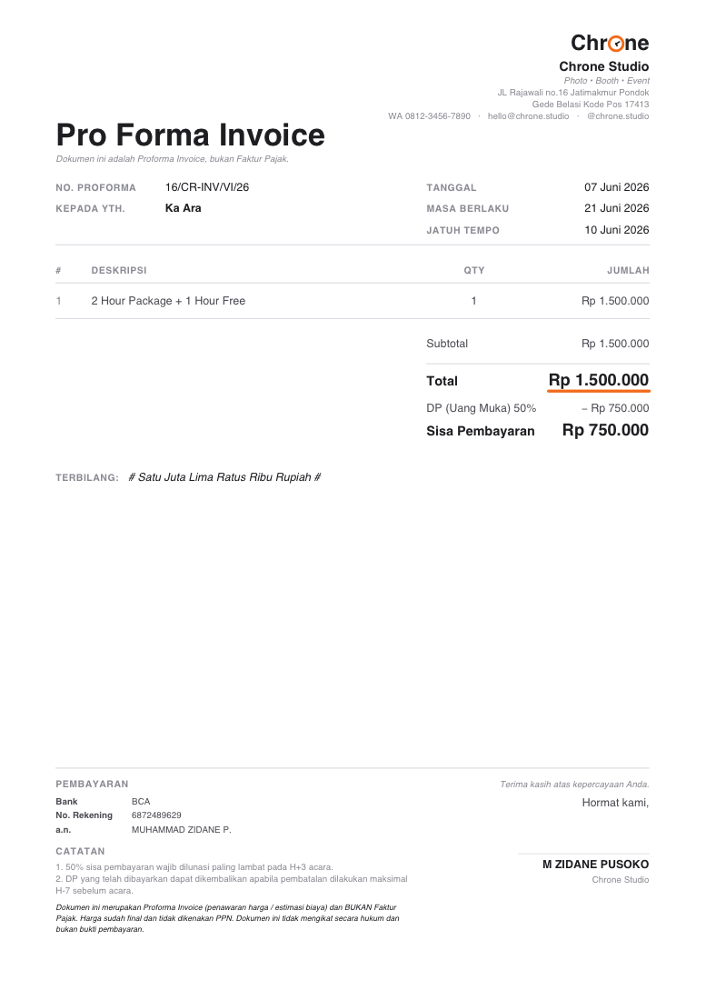

# Simple Pro Forma Invoice Generator

A simple Windows/macOS desktop app to generate Pro Forma Invoice PDFs with a
fixed layout. Fill the form → click **Generate PDF** → the PDF is saved to the
`output/` folder.

Built with **Python + CustomTkinter** (GUI) and **ReportLab** (PDF).



## Features

- **Create Invoice** and **Settings** pages (segmented nav)
- **Auto-generated invoice number** (read-only), format `16/CR-INV/VI/26`
  - sequential counter (never resets) + Roman-numeral month + 2-digit year
  - counter only advances after a PDF is generated successfully
- **Multiple items** — add/remove item rows freely
- **Live summary** panel: Subtotal / Diskon / DP / Sisa Pembayaran / Total
  update as you type
- **DP** support: Tanpa DP / Persentase / Nominal, plus optional **Diskon**
- Calendar date picker; **Save As** dialog on generate
- Rupiah formatting (`1500000` → `Rp 1.500.000`) and **Terbilang** (amount in words)
- Indonesian invoice conventions: Bahasa labels, **proforma disclaimer** (clearly
  not a Faktur Pajak), bank details, contact cluster (WA / email / Instagram)

## Design

Redesigned on a pure-white A4 page using cognitive/visual-design rules
(typographic hierarchy, Gestalt grouping, restraint). The Chrone brand shows as
a single warm-orange accent (`#F26A1B`) — the clock-face **“Chrone”** wordmark
and the Total underline — over neutral ink/gray text.

## Run from source

Requires Python 3.10+.

```bash
pip install -r requirements.txt
python main.py
```

> On macOS, CustomTkinter needs the system Tk (`brew install python-tk` if Tk
> is missing). On Windows it works out of the box.

## Invoice number

The next number is computed from `last_invoice_number` in `settings.json`.
It currently starts at `15`, so the first generated invoice is
`16/CR-INV/VI/26`. The month (`VI` = June) and year (`26` = 2026) come from the
date you generate it.

## Windows SmartScreen ("unknown publisher")

The `.exe` is **unsigned** (no paid code-signing certificate), so on first run
Windows SmartScreen shows *"Windows protected your PC"*. This is expected for
any indie app — it is not a virus or a broken download.

To run it: click **More info → Run anyway** (usually only needed once per PC).
The build embeds version metadata so the file properties show **Chrone Studio**
as the publisher name. Fully removing the prompt requires code signing (an EV
certificate for instant trust, or an OV/free-OSS certificate that builds
reputation over time). See `CARA MENJALANKAN.txt` in the release for an
end-user guide (in Bahasa Indonesia).

## Build a Windows `.exe`

You **cannot** build a Windows `.exe` from macOS (PyInstaller does not
cross-compile). Two options:

### Option A — automatic, via GitHub Actions (recommended)

Every push to `main` triggers the **Build Windows EXE** workflow
(`.github/workflows/build-windows.yml`). It builds the `.exe` on a Windows
runner and uploads it as an artifact:

1. Go to the repo on GitHub → **Actions** tab
2. Open the latest **Build Windows EXE** run
3. Download the **InvoiceGenerator-Windows** artifact (a zip)
4. Unzip and send the folder to your friend — it contains
   `InvoiceGenerator.exe`, `settings.json`, and `assets/` + `output/` folders.
   They just double-click the `.exe`. No Python needed.

### Option B — build on a Windows machine

```bat
pip install -r requirements.txt pyinstaller
pyinstaller --onefile --windowed --name InvoiceGenerator ^
  --add-data "settings.json;." --add-data "assets;assets" main.py
```

The `.exe` appears in `dist/`.

## Project structure

```
main.py              GUI (CustomTkinter)
pdf_generator.py     PDF layout (ReportLab)
settings_manager.py  settings.json + invoice-number logic
settings.json        company / bank / signature defaults + counter
requirements.txt
assets/logo.png      your logo (optional)
output/              generated PDFs
```
